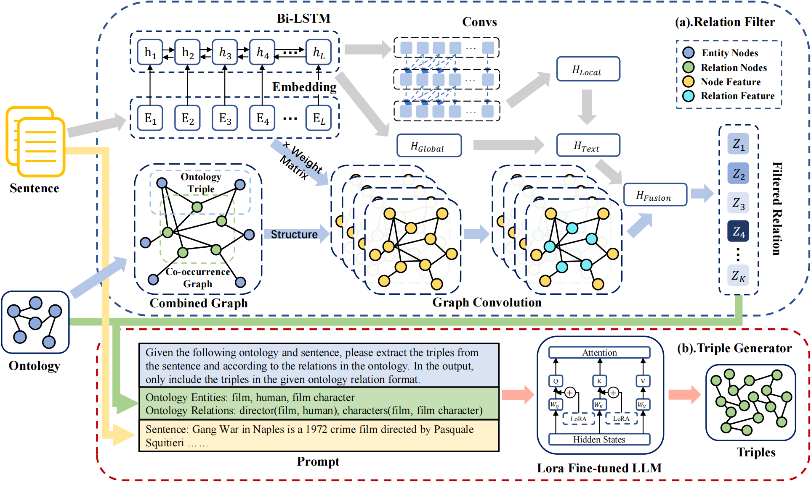

## Ontology Graph and LLM Fusion Method for Relational Triple Extraction

[](https://github.com/zjukg/KoPA/main/LICENSE)
[](https://pytorch.org/)
- Ontology Graph and LLM Fusion Method for Relational Triple Extraction
> Recent years have seen a surge in interest in Relational Triple Extraction (RTE) using Large Language Models (LLMs). Despite LLMs' proficiency in various natural language processing tasks, current LLM-based RTE methods fall short in capturing the structure essential to knowledge graph. Several studies have attempted to harness ontology graph, the foundational template of knowledge graph, to assist LLMs in comprehending the structure of knowledge graph. However, the broadness in the description of structure within the prompts constructed by these methods leads to the extraction of triples with a higher rate of hallucinations. To address this, we introduce the **O**ntology **G**raph and **L**LM Fusion method for **R**elational **T**riple **E**xtraction (**OGLRTE**). Our method enhances LLMs by integrating the ontology graph, enabling the LLMs to discern the intricate structures of knowledge graph. It utilizes a leading relation filter to selectively process the ontology structures relevant to the sentence, which is followed by a triple generator to efficiently extract relational triples with the help of fine-tuned LLMs. This dual-process ensures that information from both the ontology graph and the sentences is comprehensively utilized. Our method surpasses traditional and LLM-based methods in extracting information and mitigating hallucinations, as evidenced by its superior performance on three public datasets: CoNLL04, SciERC and Wikidata-TekGen.

## Model Architecture


## How to Run the Code
1. **Environment**
```shell
  conda create -n your_env_name python=3.11
  conda activate your_env_name
  cd OGLRTE
  pip install -r requirements.txt
```
