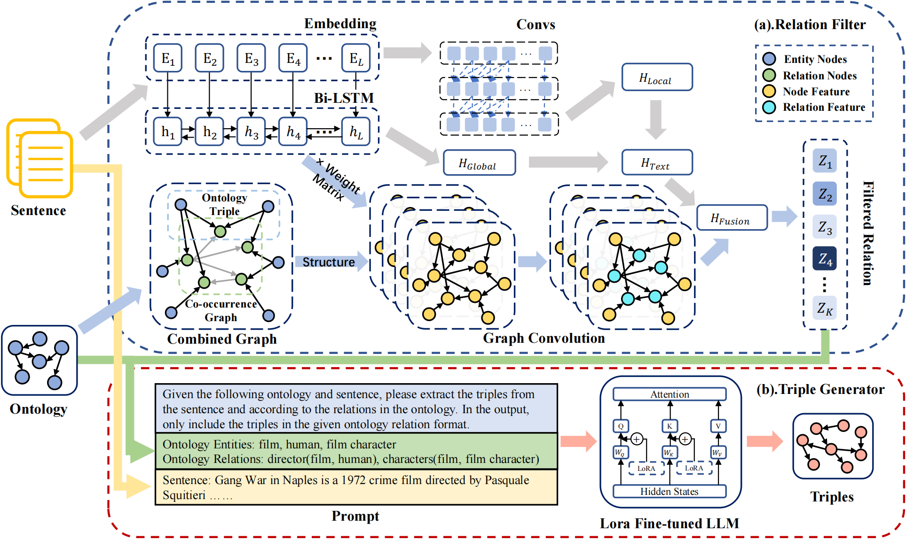

## Ontology Graph and LLM Fusion Method for Relational Triple Extraction

[](https://github.com/zjukg/KoPA/main/LICENSE)
[](https://pytorch.org/)
- Ontology Graph and LLM Fusion Method for Relational Triple Extraction
> In recent years, Relational Triple Extraction (RTE) methods leveraging Large Language Models (LLMs) have garnered lots of attention. Several studies attempted to harness ontology graph, the foundational template of knowledge graph, to assist LLMs in comprehending the structure of knowledge graph. However, the broadness of ontology graph within the prompts leads to a higher rate of hallucinations in triples. To address this, we introduce the **O**ntology **G**raph and **L**LM Fusion method for **R**elational **T**riple **E**xtraction (**OGLRTE**). In this framework, we pioneeringly designed a two-stage RTE method centered around ontology graph, comprising of a relation filter and a text generator. To fully utilize the information in knowledge graph, we proposed an innovative combination of the ontology graph and co-occurrence graph within relation filter to repersent co-occurrence of relations in knowledge graph. Additionally, we employed established fine-tuning techniques to optimize the LLM within our triple generator, thereby enhancing its capability to extract triples. Our method surpasses neural network and LLM-based methods in extracting information and mitigating hallucinations, as evidenced by its superior performance on three public datasets: CoNLL04, SciERC and Wikidata-TekGen.

## Model Architecture


## Usage
1. **Environment**

    ```shell
    conda create -n your_env_name python=3.11
    conda activate your_env_name
    cd OGLRTE
    pip install -r requirements.txt
    ```

2. **The pre-trained BERT**

    The pre-trained BERT (bert-large-uncased) can be downloaded from [this link](https://huggingface.co/google-bert/bert-large-uncased). Also, you can manually set the pre-trained BERT model path in `src/params.py`.

3. **Dataset**

    In `datasets` we perpare Space Ontology dataset to assist in running our code. The `alpaca_dataset.json` is for fine-tuning the LLM, and other json file is for relation filter.

4. **Fine-tuned LLM**

    The Fine-tuned LLaMA3.1-Instruction Model of Space Ontology can be downloaded from [this link](https://drive.google.com/file/d/1MPxrqb0chK_HLA1SMFFBapDuYW6kBRV9/view?usp=drive_link). Also, you can use LoRA or other fine-tuning method to get your fine-tuned LLM with the Space Ontology dataset `datasets/spaces/alpaca_dataset.json`.

5. **Run the Code**

    The params of training can be set in `src/params.py`. After setting the parameters, you can run the code as follows:

    ```shell
    cd src
    python model_train.py
    ```